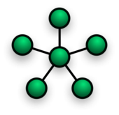

# webrtc-remote-control

A few years ago I made [topheman/webrtc-experiments](https://github.com/topheman/webrtc-experiments), as a proof of concept for WebRTC data-channels relying on PeerJS.

## The problem

[PeerJS](https://peerjs.com) is a great layer of abstraction above WebRTC with a simple API, though, you still need to:

- track your connections
- handle reconnects of peers when your page reloads

You don't want to think about this kind of networking problems, you want to focus on your app logic.

**webrtc-remote-control** handles all of that.

## The use case

**webrtc-remote-control** was made to handle star topology network:

<p style="text-align:center"></p>

You have:

- One "master" page connected to
- Multiple "remote" pages

What you can do (through data-channel):

- From "master" page, you can send data to any or all "remote" pages
- From one "remote" page, you can send data to the master page

When "master" page drops connection (the page closes or reloads), the "remote" pages are notified (and remote automatically reconnect when master retrieves connection).

When a "remote" page drops connection (the page closes or reloads), the "master" page gets notified (and the remote reconnects to master as soon as it reloads).

## The implementations

A VanillaJS implementation is available so that you can use it with any kind of code.

I also provide a few implementations for react.

### VanillaJS

```sh
npm install peerjs @webrtc-remote-control/core
```

[Documentation](./packages/core#readme)

### React

```sh
npm install peerjs @webrtc-remote-control/react
```

[Documentation](./packages/react#readme)

### Vue

```sh
npm install peerjs @webrtc-remote-control/vue
```

[Documentation](./packages/vue#readme)

## Contributing

[CONTRIBUTING](CONTRIBUTING.md)
